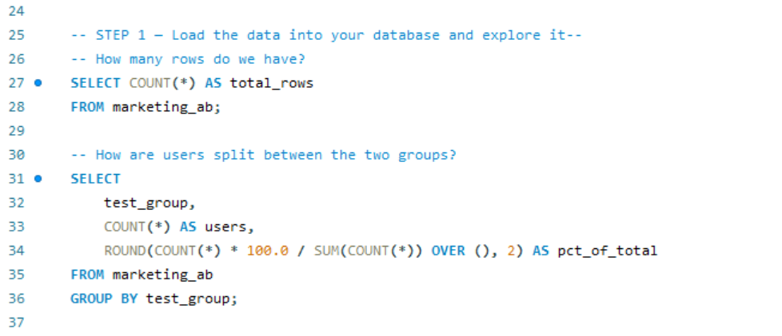
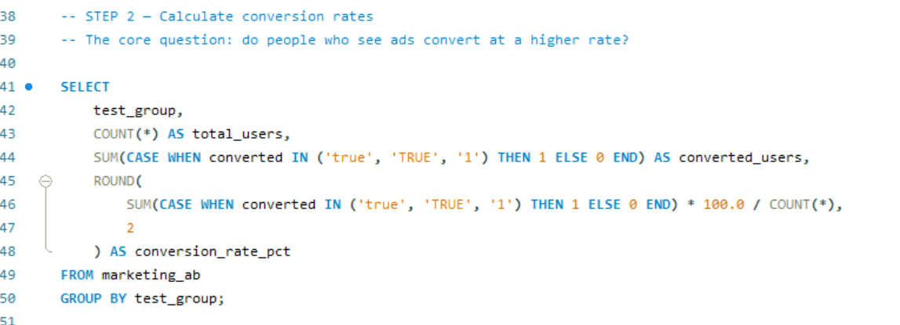
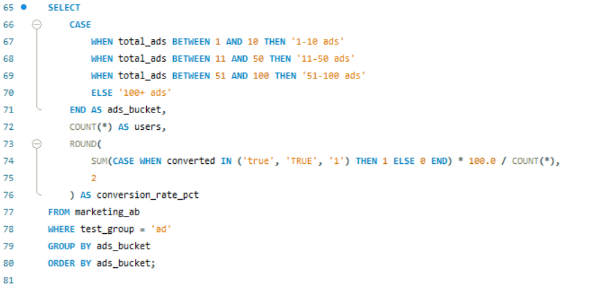
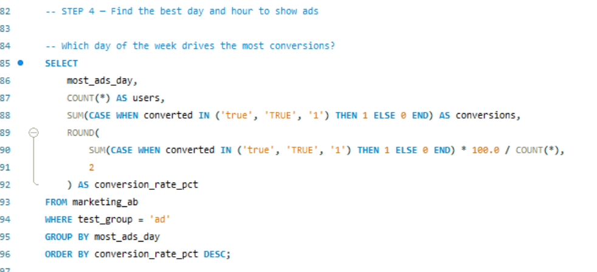
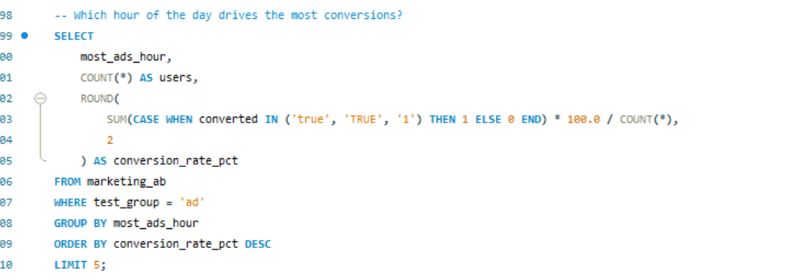

# Marketing A/B Test Analysis — SQL

## Overview

This project uses a marketing A/B test dataset of 588,101 users split into two groups: one shown real ads, one shown a public service announcement (PSA) used as a control. The data captures whether each user converted, how many ads they saw, and when they saw the most ads (day of week and hour). There is no time period attached to the raw data, but the scale of it — nearly 600,000 users — suggests a campaign run over several weeks. The business question: did the ads actually work, and if so, under what conditions?

Full SQL: [ab_testing_project.sql](ab_testing_project.sql)

## Approach

I started with group size and composition before touching conversion rates. That check immediately flagged something worth noting: the split is not 50/50. The ad group holds 96% of users; the PSA group holds the remaining 4%. That kind of imbalance does not invalidate the analysis, but it changes how much weight you put on direct group comparisons.

After that I calculated raw conversion rates by group — the headline number most stakeholders want first.

I also segmented the ad group by ad frequency (1–10, 11–50, 51–100, 100+) to see whether volume of exposure had any relationship to conversion. I chose those buckets to separate light-touch exposure from heavy retargeting, without making the buckets so granular that small sample sizes would make the rates unreliable.

The last piece was time patterns — conversion rate by day of week and by hour of day, restricted to the ad group. The goal was to give the media-buying team something actionable: not just whether ads work, but when to weight spend.

## Findings

The ad group converted at 2.55% versus 1.79% for the PSA group — a 43% relative lift. Given the sample sizes involved (roughly 564,000 users in the ad group and 23,500 in the PSA group), this difference is statistically significant.

Ad frequency has a strong relationship with conversion rate. Users who saw 1–10 ads converted at the lowest rate within the ad group. The rate climbs steadily through the 11–50 and 51–100 buckets, reaching 17% for users exposed to 100 or more ads. That is a large range — from low single digits to 17% — and it suggests that for this campaign, repetition mattered.

On timing, Monday produces the highest conversion rate among days of the week. For hours, the 14:00–16:00 window (mid-to-late afternoon) and the 20:00–21:00 window (early evening) are the strongest performers. Mid-morning and early afternoon underperform by comparison.

## Limitations

The group imbalance is the most important caveat. With 96% of users in the ad group, the PSA group is small enough that its 1.79% conversion rate is less stable. A different random sample from the same population could shift that number.

The assignment question matters more, though. I do not know how users ended up in each group. If the assignment was not truly random — for example, if users who had already shown purchase intent were disproportionately shown ads — then the conversion lift reflects selection bias, not ad effectiveness. The frequency correlation has the same problem: users who were shown 100+ ads may simply be more engaged users who visit the platform more often. If that is the case, the frequency effect is not causal.

There is also no demographic data in this dataset. Age, geography, device type, and existing customer status all affect conversion rates in most real-world campaigns, and none of that is controllable here. The time-of-day findings are descriptive — they show when conversions happened to occur, but without randomizing ad delivery times across a controlled experiment, you cannot conclude that shifting spend to Monday afternoons will replicate those rates.

---

**Tools:** MySQL  
**Dataset:** [Marketing A/B Testing Dataset — Kaggle](https://www.kaggle.com/datasets/faviovaz/marketing-ab-testing)
